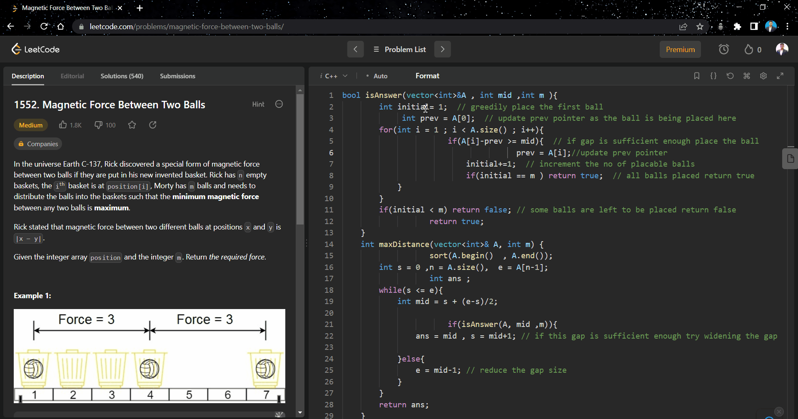

# LeetCode Code Format Google Chrome Extension

This Google chrome extension adds the Format button to the [LeetCode](https://leetcode.com/) code editor.

The format button formats the code as per the [Prettier
formatter](https://prettier.io/)

Currently, following languages are supported, with plans to add more:
* Java
* C++
* JavaScript
* TypeScript

Send your feedback and any bug reports [here](https://github.com/madhur/leetcode-format-chrome-extension/issues)

